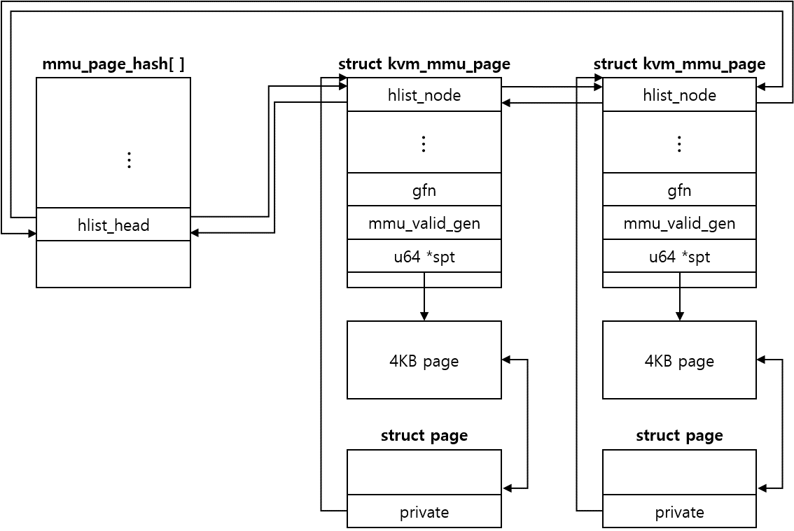

## 基础

### 页表
负责将 VA 转换为 PA。VA 的地址由页号和页内偏移量组成，转换时，先从页表的基地址寄存器 (CR3) 中读取页表的起始地址，然后加上页号得到对应页的页表项。从中取出页的物理地址，再加上偏移量得到 PA。

随着寻址范围的扩大 (64 位 CPU 支持 48 位的虚拟地址寻址空间，和 52 位的物理地址寻址空间)，页表需要占用越来越多连续的内存空间，再加上每个进程都要有自己的页表，系统光是维护页表就需要耗费大量内存。为此，利用程序使用内存的局部化特征，引进了多级页表。

目前版本的 Linux 使用了四级页表：

Page Map Level 4(PML4) => Page Directory Pointer Table(PDPT) => Page Directory(PD) => Page Table(PT)

在某些地方被称为： Page Global Directory(PGD) => Page Upper Directory(PUD) => Page Middle Directory(PMD) => Page Table(PT)

在 x86_64 下，一个普通 page 的大小为 4KB，由于地址为 64bit，因此一个页表项占 8 Byte，于是一张页表中只能存放 512 个表项。因此每级页表索引使用 9 个 bit，加上页内索引 (offset) 使用 12 个 bit，因此一个 64bit 地址中只有 0-47bit 被用到。

在 64 位下，EPT 采用了和传统页表相同的结构，于是如果不考虑 TLB，进行一次 GVA 到 HVA 需要经过 4 * 4 次 (考虑访问每一级 page 都 fault 的情况) 页表查询。

有多少次查询就要访问多少次内存，在 walk 过程中不断对内存进行访问无疑会对性能造成影响。为此引入 TLB(Translation Lookaside Buffer) ，用来缓存常用的 PTE。这样在 TLB 命中的情况下就无需到内存去进行查找了。利用程序使用内存的局部化特征，TLB 的命中率往往很高，改善了在多级页表下的的访问速度。


### 内存虚拟化
QEMU 利用 mmap 系统调用，在进程的虚拟地址空间中申请连续的大小的空间，作为 Guest 的物理内存。

在这样的架构下，内存地址访问有四层映射：

GVA - GPA - HVA - HPA

GVA - GPA 的映射由 guest OS 负责维护，而 HVA - HPA 由 host OS 负责维护。于是我们需要一种机制，来维护 GPA - HVA 的映射。常用的实现有 SPT(Shadow Page Table) 和 EPT/NPT ，前者通过软件维护影子页表，后者通过硬件特性实现二级映射。


### 影子页表
KVM 通过维护 GVA 到 HPA 的页表 SPT ，实现了直接映射。于是页表可被物理 MMU 寻址使用。如何实现的呢：

KVM 将 Guest OS 的页表设置为 read-only ，当 Guest OS 进行修改时会触发 page fault， VMEXIT 到 KVM 。 KVM 会对 GVA 对应的页表项进行访问权限检查，结合错误码进行判断:

1. 如果是由 Guest OS 引起的，则将该异常注入回去。 Guest OS 调用自己的 page fault 处理函数 (申请一个 page ，将 page 的 GPA 填充到 上级页表项中)
2. 如果是 Guest OS 的页表和 SPT 不一致引起的，则同步 SPT ，根据 Guest OS 页表和 mmap 映射找到 GVA 到 GPA 再到 HVA 的映射关系，然后在 SPT 中增加 / 更新 GVA - HPA 的表项

当 Guest OS 切换进程时，会把待切换进程的页表基址载入 Guest 的 CR3，导致 VM EXIT 回到 KVM。KVM 通过哈希表找到对应的 SPT ，然后加载机器的 CR3 中。

缺点：需要为每个进程都维护一张 SPT ，带来额外的内存开销。需要保持 Guest OS 页表和 SPT 的同步。每当 Guest 发生 page fault ，即使是 guest 自身缺页导致的，都会导致 VMExit ，开销大。


### EPT / NPT
Intel EPT 技术 引入了 EPT(Extended Page Table) 和 EPTP(EPT base pointer) 的概念。 EPT 中维护着 GPA 到 HPA 的映射，而 EPT base pointer 负责指向 EPT 。在 Guest OS 运行时，该 VM 对应的 EPT 地址被加载到 EPTP ，而 Guest OS 当前运行的进程页表基址被加载到 CR3 ，于是在进行地址转换时，首先通过 CR3 指向的页表实现 GVA 到 GPA 的转换，再通过 EPTP 指向的 EPT 实现从 GPA 到 HPA 的转换。

在发生 EPT page fault 时，需要 VMExit 到 KVM，更新 EPT 。

AMD NPT(Nested Page Table) 是 AMD 搞出的解决方案，它原理和 EPT 类似，但描述和实现上略有不同。Guest OS 和 Host 都有自己的 CR3 。当进行地址转换时，根据 gCR3 指向的页表从 GVA 到 GPA ，然后根据 nCR3 指向的页表从 GPA 到 HPA 。

优点：Guest 的缺页在 guest 内处理，不会 vm exit。地址转换基本由硬件 (MMU) 查页表完成。

缺点：两级页表查询，只能寄望于 TLB 命中。


## 实现

### QEMU

#### 内存设备模拟

##### PCDIMMDevice

```c
typedef struct PCDIMMDevice {
    /* private */
    DeviceState parent_obj;

    /* public */
    uint64_t addr;                  // 映射到的起始 GPA
    uint32_t node;                  // 映射到的 numa 节点
    int32_t slot;                   // 插入的内存槽编号，默认为 -1，表示自动分配
    HostMemoryBackend *hostmem;     // 对应的 backend
} PCDIMMDevice;
```

通过 QOM(qemu object model) 定义的虚拟内存条。可通过 QMP 或 QEMU 命令行进行管理。通过增加 / 移除该对象实现 VM 中内存的热插拔。


##### HostMemoryBackend

```c
struct HostMemoryBackend {
    /* private */
    Object parent;

    /* protected */
    uint64_t size;                                  // 提供内存大小
    bool merge, dump;
    bool prealloc, force_prealloc, is_mapped;
    DECLARE_BITMAP(host_nodes, MAX_NODES + 1);
    HostMemPolicy policy;

    MemoryRegion mr;                                // 拥有的 MemoryRegion
};
```

通过 QOM 定义的一段 Host 内存，为虚拟内存条提供内存。可通过 QMP 或 QEMU 命令行进行管理。


#### 内存初始化

在开启 KVM 的前提下， QEMU 通过以下流程初始化内存：


```
main => configure_accelerator => kvm_init => kvm_memory_listener_register(s, &s->memory_listener, &address_space_memory, 0) 初始化
kvm_state.memory_listener
                                          => kml->listener.region_add = kvm_region_add                      为 listener 设置操作
                                          => memory_listener_register                                       初始化 listener 并绑定到 address_space_memory
                                          => memory_listener_register(&kvm_io_listener, &address_space_io)  初始化 kvm_io_listener 并绑定到 address_space_io
     => cpu_exec_init_all => memory_map_init                                        创建 system_memory("system") 和 system_io("io") 两个全局 MemoryRegion
                                 => address_space_init                              初始化 address_space_memory("memory") 和 address_space_io("I/O") AddressSpace，并把 system_memory 和 system_io 作为 root
                                    => memory_region_transaction_commit             提交修改，引起地址空间的变化
```

在进行进一步分析之前，我们先介绍下涉及的三种结构： AddressSpace 、 MemoryRegion 和 MemoryRegionSection ：

#### AddressSpace

```c
struct AddressSpace {
    /* All fields are private. */
    struct rcu_head rcu;
    char *name;
    MemoryRegion *root;
    int ref_count;
    bool malloced;

    /* Accessed via RCU.  */
    struct FlatView *current_map;                               // 指向当前维护的 FlatView，在 address_space_update_topology 时作为 old 比较

    int ioeventfd_nb;
    struct MemoryRegionIoeventfd *ioeventfds;
    struct AddressSpaceDispatch *dispatch;                      // 负责根据 GPA 找到 HVA
    struct AddressSpaceDispatch *next_dispatch;
    MemoryListener dispatch_listener;
    QTAILQ_HEAD(memory_listeners_as, MemoryListener) listeners;
    QTAILQ_ENTRY(AddressSpace) address_spaces_link;
};
```

顾名思义，用来表示虚拟机的一片地址空间，如内存地址空间，IO 地址空间。每个 AddressSpace 一般包含一系列 MemoryRegion ： AddressSpace 的 root 指向根级 MemoryRegion ，该 MemoryRegion 有可能有自己的若干个 subregion ，于是形成树状结构。

如上文所述，在内存初始化流程中调用了 memory_map_init ，其初始化了 address_space_memory 和 address_space_io ，其中：

* address_space_memory 的 root 为 system_memory
* address_space_io 的 root 为 system_io


#### MemoryRegion

```c
struct MemoryRegion {
    Object parent_obj;                                                  // 继承自 Object

    /* All fields are private - violators will be prosecuted */

    /* The following fields should fit in a cache line */
    bool romd_mode;
    bool ram;
    bool subpage;
    bool readonly; /* For RAM regions */
    bool rom_device;                                                    // 是否只读
    bool flush_coalesced_mmio;
    bool global_locking;
    uint8_t dirty_log_mask;                                             // dirty map 类型
    RAMBlock *ram_block;                                                // 指向对应的 RAMBlock
    Object *owner;
    const MemoryRegionIOMMUOps *iommu_ops;

    const MemoryRegionOps *ops;
    void *opaque;
    MemoryRegion *container;                                            // 指向父 MemoryRegion
    Int128 size;                                                        // 内存区域大小
    hwaddr addr;                                                        // 在父 MemoryRegion 中的偏移量 (见 memory_region_add_subregion_common)
    void (*destructor)(MemoryRegion *mr);
    uint64_t align;
    bool terminates;
    bool ram_device;
    bool enabled;
    bool warning_printed; /* For reservations */
    uint8_t vga_logging_count;
    MemoryRegion *alias;                                                // 指向实体 MemoryRegion
    hwaddr alias_offset;                                                // 起始地址 (GPA) 在实体 MemoryRegion 中的偏移量
    int32_t priority;
    QTAILQ_HEAD(subregions, MemoryRegion) subregions;                   // subregion 链表
    QTAILQ_ENTRY(MemoryRegion) subregions_link;
    QTAILQ_HEAD(coalesced_ranges, CoalescedMemoryRange) coalesced;
    const char *name;
    unsigned ioeventfd_nb;
    MemoryRegionIoeventfd *ioeventfds;
    QLIST_HEAD(, IOMMUNotifier) iommu_notify;
    IOMMUNotifierFlag iommu_notify_flags;
};
```

MemoryRegion 表示在 Guest memory layout 中的一段内存，具有逻辑 (Guest) 意义。

在初始化 VM 的过程中，建立了相应的 MemoryRegion ：

```
pc_init1 / pc_q35_init => pc_memory_init => memory_region_allocate_system_memory                        初始化 MemoryRegion 并为其分配内存
                                         => memory_region_init_alias => memory_region_init              初始化 alias MemoryRegion
                                         => memory_region_init                                          初始化 MemoryRegion
                                         => memory_region_init_ram => memory_region_init                初始化 MemoryRegion 并分配 Ramblock
```


##### memory_region_allocate_system_memory

对于非 NUMA 架构的 VM ，直接分配内存

```
=> allocate_system_memory_nonnuma => memory_region_init_ram_from_file / memory_region_init_ram          分配 MemoryRegion 对应 Ramblock 的内存
=> vmstate_register_ram                                                                                 根据 region 的名称 name 设置 RAMBlock 的 idstr
```

对于 NUMA，分配后需要设置 HostMemoryBackend

```
=> memory_region_init
=> memory_region_add_subregion                          遍历所有 NUMA 节点的内存 HostMemoryBackend ，依次把那些 mr 成员不为空的作为当前 MemoryRegion 的 subregion，偏移量从 0 开始递增
=> vmstate_register_ram_global => vmstate_register_ram  根据 region 的名称 name 设置 RAMBlock 的 idstr
```

##### MemoryRegion 类型

可将 MemoryRegion 划分为以下三种类型：

* 根级 MemoryRegion: 直接通过 memory_region_init 初始化，没有自己的内存，用于管理 subregion。如 system_memory
* 实体 MemoryRegion: 通过 memory_region_init_ram 初始化，有自己的内存 (从 QEMU 进程地址空间中分配)，大小为 size 。如 ram_memory(pc.ram) 、 pci_memory(pci) 等
* 别名 MemoryRegion: 通过 memory_region_init_alias 初始化，没有自己的内存，表示实体 MemoryRegion(如 pc.ram) 的一部分，通过 alias 成员指向实体 MemoryRegion，alias_offset 为在实体 MemoryRegion 中的偏移量。如 ram_below_4g 、ram_above_4g 等

代码中常见的 MemoryRegion 关系为：

```
                  alias
ram_memory (pc.ram) - ram_below_4g(ram-below-4g)
                    - ram_above_4g(ram-above-4g)

             alias
system_io(io) - (pci0-io)
              - (isa_mmio)
              - (isa-io)
              - ...

                     sub
system_memory(system) - ram_below_4g(ram-below-4g)
                      - ram_above_4g(ram-above-4g)
                      - pcms->hotplug_memory.mr        热插拔内存

          sub
rom_memory - isa_bios(isa-bios)
           - option_rom_mr(pc.rom)

```

同时将 AddressSpace 映射到 FlatView ，得到若干个 MemoryRegionSection ，调用 kvm_region_add ，将 MemoryRegionSection 注册到 KVM 中。


##### MemoryRegionSection

```c
struct MemoryRegionSection {
    MemoryRegion *mr;                           // 指向所属 MemoryRegion
    AddressSpace *address_space;                // 所属 AddressSpace
    hwaddr offset_within_region;                // 起始地址 (HVA) 在 MemoryRegion 内的偏移量
    Int128 size;
    hwaddr offset_within_address_space;         // 在 AddressSpace 内的偏移量，如果该 AddressSpace 为系统内存，则为 GPA 起始地址
    bool readonly;
};
```

MemoryRegionSection 指向 MemoryRegion 的一部分 ([offset_within_region, offset_within_region + size])，是注册到 KVM 的基本单位。

将 AddressSpace 中的 MemoryRegion 映射到线性地址空间后，由于重叠的关系，原本完整的 region 可能会被切分成片段，于是产生了 MemoryRegionSection。

回头再看内存初始化的流程，做的工作很简单：创建一些 AddressSpace ，绑定 listener 。创建相应的 MemoryRegion，作为 AddressSpace 的根。最后提交修改，让地址空间的发生变化，更新到 KVM 中。下面将分点介绍。


##### KVMMemoryListener

在初始化过程中，我们为 address_space_memory 和 address_space_io 分别注册了 memory_listener 和 kvm_io_listener 。前者类型为 KVMMemoryListener ，后者类型为 MemoryListener：

```c
typedef struct KVMMemoryListener {
    MemoryListener listener;
    KVMSlot *slots;
    int as_id;
} KVMMemoryListener;

struct MemoryListener {void (*begin)(MemoryListener *listener);
    void (*commit)(MemoryListener *listener);
    void (*region_add)(MemoryListener *listener, MemoryRegionSection *section);
    void (*region_del)(MemoryListener *listener, MemoryRegionSection *section);
    void (*region_nop)(MemoryListener *listener, MemoryRegionSection *section);
    void (*log_start)(MemoryListener *listener, MemoryRegionSection *section,
                      int old, int new);
    void (*log_stop)(MemoryListener *listener, MemoryRegionSection *section,
                     int old, int new);
    void (*log_sync)(MemoryListener *listener, MemoryRegionSection *section);
    void (*log_global_start)(MemoryListener *listener);
    void (*log_global_stop)(MemoryListener *listener);
    void (*eventfd_add)(MemoryListener *listener, MemoryRegionSection *section,
                        bool match_data, uint64_t data, EventNotifier *e);
    void (*eventfd_del)(MemoryListener *listener, MemoryRegionSection *section,
                        bool match_data, uint64_t data, EventNotifier *e);
    void (*coalesced_mmio_add)(MemoryListener *listener, MemoryRegionSection *section,
                               hwaddr addr, hwaddr len);
    void (*coalesced_mmio_del)(MemoryListener *listener, MemoryRegionSection *section,
                               hwaddr addr, hwaddr len);
    /* Lower = earlier (during add), later (during del) */
    unsigned priority;
    AddressSpace *address_space;
    QTAILQ_ENTRY(MemoryListener) link;
    QTAILQ_ENTRY(MemoryListener) link_as;
};
```

可以看到 KVMMemoryListener 主体就是 MemoryListener ，而 MemoryListener 包含大量函数指针，用来指向 address_space 成员发生变化时调用的回调函数。

address_space_io 上绑有 kvm_io_listener 和 dispatch_listener 。因此 AddressSpace 和 listener 存在一对多的关系，当 AddressSpace 发生变化时，其绑定的所有 listener 都会被触发。这是如何实现的呢？

实际上，任何对 AddressSpace 和 MemoryRegion 的操作，都以 memory_region_transaction_begin 开头，以 memory_region_transaction_commit 结尾。

这些操作包括：启用、析构、增删 eventfd、增删 subregion、改变属性 (flag)、设置大小、开启 dirty log 等，如：

* memory_region_add_subregion
* memory_region_del_subregion
* memory_region_set_readonly
* memory_region_set_enabled
* memory_region_set_size
* memory_region_set_address
* memory_region_set_alias_offset
* memory_region_readd_subregion
* memory_region_update_container_subregions
* memory_region_set_log
* memory_region_finalize
* ...

对 AddressSpace 的 root MemoryRegion 进行操作：

* address_space_init
* address_space_destroy

##### memory_region_transaction_begin

```
=> qemu_flush_coalesced_mmio_buffer => kvm_flush_coalesced_mmio_buffer
=> ++memory_region_transaction_depth
```

KVM 中对某些 MMIO 做了 batch 优化：KVM 遇到 MMIO 而 VMEXIT 时，将 MMIO 操作记录到 kvm_coalesced_mmio 结构中，然后塞到 kvm_coalesced_mmio_ring 中，不退出到 QEMU 。直到某一次退回到 QEMU ，要更新内存空间之前的那一刻，把 kvm_coalesced_mmio_ring 中的 kvm_coalesced_mmio 取出来做一遍，保证内存的一致性。这事就是 kvm_flush_coalesced_mmio_buffer 干的。


##### memory_region_transaction_commit

```
=> --memory_region_transaction_depth
=> 如果 memory_region_transaction_depth 为 0 且 memory_region_update_pending 大于 0
    => MEMORY_LISTENER_CALL_GLOBAL(begin, Forward)        从前向后调用全局列表 memory_listeners 中所有 listener 的 begin 函数
    => 对 address_spaces 中的所有 address space，调用 address_space_update_topology ，更新 QEMU 和 KVM 中维护的 slot 信息。
    => MEMORY_LISTENER_CALL_GLOBAL(commit, Forward)       从后向前调用全局列表 memory_listeners 中所有 listener 的 commit 函数
```

调用 listener 对应的函数来实现对地址空间的更新。

##### address_space_update_topology

```
=> address_space_get_flatview                             获取原来 FlatView(AddressSpace.current_map)
=> generate_memory_topology                               生成新的 FlatView
=> address_space_update_topology_pass                     比较新老 FlatView，对其中不一致的 FlatRange，执行相应的操作。
```

由于 AddressSpace 是树状结构，于是调用 address_space_update_topology ，使用 FlatView 模型将树状结构映射 (压平) 到线性地址空间。比较新老 FlatView，对其中不一致的 FlatRange，执行相应的操作，最终操作的 KVM。

##### generate_memory_topology

```
=> addrrange_make                   创建起始地址为 0，结束地址为 2^64 的地址空间，作为 guest 的线性地址空间
=> render_memory_region             从根级 region 开始，递归将 region 映射到线性地址空间中，产生一个个 FlatRange，构成 FlatView
=> flatview_simplify                将 FlatView 中连续的 FlatRange 进行合并为一个
```

AddressSpace 的 root 成员是该地址空间的根级 MemoryRegion ，generate_memory_topology 负责将它的树状结构进行压平，从而能够映射到一个线性地址空间，得到 FlatView 。

##### address_space_update_topology_pass

比较该 AddressSpace 的新老 FlatRange 是否有变化，如果有，从前到后或从后到前遍历 AddressSpace 的 listeners，调用对应 callback 函数。

```
=> MEMORY_LISTENER_UPDATE_REGION => section_from_flat_range      根据 FlatRange 的范围构造 MemoryRegionSection
                                 => MEMORY_LISTENER_CALL
```

举个例子，前面提到过，在初始化流程中，注册了 kvm_state.memory_listener 作为 address_space_memory 的 listener，它会被加入到 AddressSpace 的 listeners 中。于是如果 address_space_memory 发生了变化，则调用会调用 memory_listener 中相应的函数。

例如 MEMORY_LISTENER_UPDATE_REGION 传入的 callback 参数为 region_add ，则调用 memory_listener.region_add (kvm_region_add)。


##### kvm_region_add

```
=> kvm_set_phys_mem => kvm_lookup_overlapping_slot
                    => 计算起始 HVA
                    => kvm_set_user_memory_region => kvm_vm_ioctl(s, KVM_SET_USER_MEMORY_REGION, &mem)
```

kvm_lookup_overlapping_slot 用于判断新的 region section 的地址范围 (GPA) 是否与已有 KVMSlot(kml->slots) 有重叠，如果重叠了，需要进行处理：

假设原 slot 可以切分成三个部分：prefix slot + overlap slot + suffix slot，重叠区域为 overlap

对于完全重叠的情况，既有 prefix slot 又有 suffix slot。无需注册新 slot。

对于部分重叠的情况，prefix slot = 0 或 suffix slot = 0。则执行以下流程：

1. 删除原有 slot
2. 注册 prefix slot 或 suffix slot
3. 注册 overlap slot

当然如果没有重叠，则直接注册新 slot 即可。然后将 slot 通过 kvm_vm_ioctl(s, KVM_SET_USER_MEMORY_REGION, &mem) 更新 KVM 中对应的 kvm_memory_slot 。

QEMU 中维护 slot 结构也需要更新，对于原有的 slot，因为它是 kml->slots 数组的项，所以在 kvm_set_phys_mem 直接修改即可。对于 kml->slots 中没有的 slot，如 prefix、suffix、overlap，则需要调用 kvm_alloc_slot => kvm_get_free_slot ，它会在 kml->slots 找一个空白的 (memory_size = 0) 为 slot 返回，然后对该 slot 进行设置。

##### kvm_set_phys_mem => kvm_set_user_memory_region

KVM 规定了更新 memory slot 的参数为 kvm_userspace_memory_region ：

```c
struct kvm_userspace_memory_region {
    __u32 slot;                                                             // 对应 kvm_memory_slot 的 id
    __u32 flags;
    __u64 guest_phys_addr;                                                  // GPA
    __u64 memory_size; /* bytes */                                          // 大小
    __u64 userspace_addr; /* start of the userspace allocated memory */     // HVA
};
```

它会在 kvm_set_phys_mem => kvm_set_user_memory_region 的过程中进行计算并填充，流程如下：

1. 根据 region 的起始 HVA(memory_region_get_ram_ptr) + region section 在 region 中的偏移量 (offset_within_region) + 页对齐修正 (delta) 得到 section 真正的起始 HVA，填入 userspace_addr

    在 memory_region_get_ram_ptr 中，如果当前 region 是另一个 region 的 alias，则会向上追溯，一直追溯到非 alias region(实体 region) 为止。将追溯过程中的 alias_offset 加起来，可以得到当前 region 在实体 region 中的偏移量。

    由于实体 region 具有对应的 RAMBlock，所以调用 qemu_map_ram_ptr ，将实体 region 对应的 RAMBlock 的 host 和总 offset 加起来，得到当前 region 的起始 HVA。

2. 根据 region section 在 AddressSpace 内的偏移量 (offset_within_address_space) + 页对齐修正 (delta) 得到 section 真正的 GPA，填入 start_addr

3. 根据 region section 的大小 (size) - 页对齐修正 (delta) 得到 section 真正的大小，填入 memory_size


### RAMBlock

前面提到，MemoryRegion 表示在 guest memory layout 中的一段内存，具有逻辑意义。那么实际意义，也是就是这段内存所对应的实际内存信息是由谁维护的呢？

我们可以发现在 MemoryRegion 有一个 ram_block 成员，它是一个 RAMBlock 类型的指针，由 RAMBlock 来负责维护实际的内存信息，如 HVA、GPA。比如在刚刚计算 userspace_addr 的流程中，计算 region 的起始 HVA 需要找到对应的 RAMBlock ，然后获取其 host 成员来得到。

RAMBlock 定义如下：

```c
struct RAMBlock {
    struct rcu_head rcu;                                        // 用于保护 Read-Copy-Update
    struct MemoryRegion *mr;                                    // 对应的 MemoryRegion
    uint8_t *host;                                              // 对应的 HVA
    ram_addr_t offset;                                          // 在 ram_list 地址空间中的偏移 (要把前面 block 的 size 都加起来)
    ram_addr_t used_length;                                     // 当前使用的长度
    ram_addr_t max_length;                                      // 总长度
    void (*resized)(const char*, uint64_t length, void *host);  // resize 函数
    uint32_t flags;
    /* Protected by iothread lock.  */
    char idstr[256];                                            // id
    /* RCU-enabled, writes protected by the ramlist lock */
    QLIST_ENTRY(RAMBlock) next;                                 // 指向在 ram_list.blocks 中的下一个 block
    int fd;                                                     // 映射文件的文件描述符
    size_t page_size;                                           // page 大小，一般和 host 保持一致
};
```

前文提到过， MemoryRegion 会调用 memory_region_* 对 MemoryRegion 结构进行初始化。常见的函数有以下几个：

* memory_region_init_ram => qemu_ram_alloc
    通过 qemu_ram_alloc 创建的 RAMBlock.host 为 NULL

* memory_region_init_ram_from_file => qemu_ram_alloc_from_file
    通过 qemu_ram_alloc_from_file 创建的 RAMBlock 会调用 file_ram_alloc 使用对应路径的 (设备) 文件来分配内存，通常是由于需要使用 hugepage，会通过 `-mem-path` 参数指定了 hugepage 的设备文件 (如 /dev/hugepages)

* memory_region_init_ram_ptr => qemu_ram_alloc_from_ptr
    RAMBlock.host 为传入的指针地址，表示从该地址指向的内存分配内存

* memory_region_init_resizeable_ram => qemu_ram_alloc_resizeable
    RAMBlock.host 为 NULL，但 resizeable 为 true，表示还没有分配内存，但可以 resize。


qemu_ram_alloc_* (qemu_ram_alloc / qemu_ram_alloc_from_file / memory_region_init_ram_ptr / memory_region_init_resizeable_ram) 最后都会调用到  qemu_ram_alloc_internal => ram_block_add 。它如果发现 host 为 NULL ，则会调用 phys_mem_alloc (qemu_anon_ram_alloc) 分配内存。让 host 有所指向后，将该 RAMBlock 插入到 ram_list.blocks 中。


##### qemu_anon_ram_alloc

=> qemu_ram_mmap(-1, size, QEMU_VMALLOC_ALIGN, false) => mmap

通过 mmap 在 QEMU 的进程地址空间中分配 size 大小的内存。


### RAMList

ram_list 是一个全局变量，以链表的形式维护了所有的 RAMBlock 。

```c
RAMList ram_list = {.blocks = QLIST_HEAD_INITIALIZER(ram_list.blocks) };

typedef struct RAMList {
    QemuMutex mutex;
    RAMBlock *mru_block;
    /* RCU-enabled, writes protected by the ramlist lock. */
    QLIST_HEAD(, RAMBlock) blocks;                              // RAMBlock 链表
    DirtyMemoryBlocks *dirty_memory[DIRTY_MEMORY_NUM];          // 记录脏页信息，用于 VGA / TCG / Live Migration
    uint32_t version;                                           // 每更改一次加 1
} RAMList;
extern RAMList ram_list;
```

注：

* VGA: 显卡仿真通过 dirty_memory 跟踪 dirty 的视频内存，用于重绘界面
* TCG: 动态翻译器通过 dirty_memory 追踪自调整的代码，当上游指令发生变化时对其重新编译
* Live Migration: 动态迁移通过 dirty_memory 来跟踪 dirty page，在 dirty page 被改变之后重传


##### AddressSpaceDispatch

根据：

```
address_space_init => address_space_init_dispatch => as->dispatch_listener = (MemoryListener) {
                                                                            .begin = mem_begin,
                                                                            .commit = mem_commit,
                                                                            .region_add = mem_add,
                                                                            .region_nop = mem_add,
                                                                            .priority = 0,
                                                                        };
                                                  => memory_listener_register(as->dispatch_listener)
```

address_space_memory 上除了绑有 kvm_state.memory_listener ，还会创建并绑定 dispatch_listener 。该 listener 实现了为了在虚拟机退出时根据 GPA 找到对应的 HVA 。

当 memory_region_transaction_commit 调用各个 listener 的 begin 函数时， mem_begin 被调用

```
=> g_new0(AddressSpaceDispatch, 1)                  创建 AddressSpaceDispatch 结构作为 AddressSpace 的 next_dispatch 成员
```

AddressSpaceDispatch 结构如下：

```c
struct AddressSpaceDispatch {
    struct rcu_head rcu;

    MemoryRegionSection *mru_section;
    /* This is a multi-level map on the physical address space.
     * The bottom level has pointers to MemoryRegionSections.
     */
    PhysPageEntry phys_map;
    PhysPageMap map;            // GPA -> HVA 的映射，通过多级页表实现
    AddressSpace *as;
};
```

map 成员是一个多级 (6 级) 页表，最后一级页表指向 MemoryRegionSection 。

当 address_space_update_topology_pass => address_space_update_topology_pass 处理 add 时， mem_add 被调用：

于是调用 register_subpage / register_multipage 将 page 注册到页表中。

```
=> 如果 MemoryRegionSection 所属的 MemoryRegion 的 subpage 不存在
    => subpage_init                                         创建 subpage
    => phys_page_set => phys_map_node_reserve               分配页目录项
                     => phys_page_set_level                 填充页表，从 L5 填到 L0
=> 如果存在
    => container_of(existing->mr, subpage_t, iomem)         取出
=> subpage_register                                         设置 subpage
```

因此从 KVM 中退出到 QEMU 之后，通过 AddressSpaceDispatch.map 可以找到对应的 MemoryRegionSection ，继而找到对应的 HVA


## KVM


### kvm_vm_ioctl_set_memory_region

Add memory. Called when KVM receives an ioctl from KVM_SET_USER_MEMORY_REGION(KVM_SET_MEMORY_REGION has been replaced because fine-grained control is not supported).

Incoming parameters are as follows：

```c
struct kvm_userspace_memory_region {
    __u32 slot;                                                             // id corresponding to kvm_memory_slot
    __u32 flags;
    __u64 guest_phys_addr;                                                  // GPA
    __u64 memory_size; /* bytes */                                          // size
    __u64 userspace_addr; /* start of the userspace allocated memory */     // HVA
};
```

flags Options：

* Declares KVM_MEM_LOG_DIRTY_PAGES for write tracking to Region. Read them when KVM_GET_DIRTY_LOG is provided.
* If KVM_MEM_READONLY supports readonly(KVM_CAP_READONLY_MEM), VMEXIT(KVM_EXIT_MMIO) is triggered when this Region is written.

kvm_vm_ioctl_set_memory_region => kvm_set_memory_region => __kvm_set_memory_region

This function determines user actions based on npages(included in the region) and the original npages：

#### KVM_MR_CREATE
If you have a page now and you don't have one, create and initialize a slot to add more memory space.

#### KVM_MR_DELETE
If there is no page now, mark the slot as KVM_MEMSLOT_INVALID to clear the memory area.

#### KVM_MR_FLAGS_ONLY / KVM_MR_MOVE
If you have a page now and you have one, you can modify the memory area, if only the flag changes, KVM_MR_FLAGS_ONLY, and if it is currently possible only KVM_MEM_LOG_DIRTY_PAGES, select whether to create or release the dirty_bitmap according to the flag.

If GPA changes, KVM_MR_MOVE must be moved. In fact, the original slot is marked as KVM_MEMSLOT_INVALID and a new one is added.

The new/modified slots are updated with install_new_memslots.

#### kvm_memory_slot

The slot for the __kvm_set_memory_region operation is the default uint of memory management in the KVM and is defined as follows：

```c
struct kvm_memory_slot {
    gfn_t base_gfn;                     // start gfn for slot
    unsigned long npages;               // page number
    unsigned long *dirty_bitmap;        // dirty page bitmap
    struct kvm_arch_memory_slot arch;   // configuration correlation, including rmap and lpage_info, etc.
    unsigned long userspace_addr;       // Corresponding starting HVA
    u32 flags;
    short id;
};


struct kvm_arch_memory_slot {struct kvm_rmap_head *rmap[KVM_NR_PAGE_SIZES];              // reverse link
    struct kvm_lpage_info *lpage_info[KVM_NR_PAGE_SIZES - 1];   // maintaining whether the next levvel of page table is turned off hugepage
    unsigned short *gfn_track[KVM_PAGE_TRACK_MAX];
};
```

slot is sotred in kvm->memslots[as_id]->memslots[id]->memslots[id] where as_is is address space id. In fact, the typical architecture always has only one address space, as_id always takes 0. Only x86 requires two address space, as_id = 0 is normal address space, and as_id = 1 is the SRAM space dedicated to SMM mode, and id is the slot id. Memory for all of these configurations is allocated to kvm_create_vm. It is initialized here.


### Memory Management Unit (MMU)

#### Initialization

```
kvm_init => kvm_arch_init => kvm_mmu_module_init => configure mmu_page_header_cache as cache
                                                 => register_shrinker(&mmu_shrinker)                registration recovery function


kvm_vm_ioctl_create_vcpu =>
kvm_arch_vcpu_create => kvm_x86_ops->vcpu_create (vmx_create_vcpu) => init_rmode_identity_map       Configuring a 1024-page equivalent map for real mode
                                                                   => kvm_vcpu_init => kvm_arch_vcpu_init => kvm_mmu_create
kvm_arch_vcpu_setup => kvm_mmu_setup => init_kvm_mmu => init_kvm_tdp_mmu                            set properties and functions in vcpu->arch.mmu if two dimensional paging(EPT) is supported and initialized
                                                     => init_kvm_softmmu => kvm_init_shadow_mmu     Otherwise, initialize the SPT
```


##### kvm_mmu_create

Initializes mmu-related information on a per-vcpu basis. Their definitions in vcpu include the following：

```c
struct kvm_vcpu_arch {
    ...
    /*
     * Paging state of the vcpu
     *
     * If the vcpu runs in guest mode with two level paging this still saves
     * the paging mode of the l1 guest. This context is always used to
     * handle faults.
     */
    struct kvm_mmu mmu;

    /*
     * Paging state of an L2 guest (used for nested npt)
     *
     * This context will save all necessary information to walk page tables
     * of the an L2 guest. This context is only initialized for page table
     * walking and not for faulting since we never handle l2 page faults on
     * the host.
     */
    struct kvm_mmu nested_mmu;

    /*
     * Pointer to the mmu context currently used for
     * gva_to_gpa translations.
     */
    struct kvm_mmu *walk_mmu;

    // The following is used to speed up deployment of commonly used data structures
    // Used to allocate pte_list_desc, which is a chain table entry in reverse map chain table parent_ptes, from mmu_set_spte => rmap_add => pte_list_add
    struct kvm_mmu_memory_cache mmu_pte_list_desc_cache;
    // Used to allocate pages as kvm_mmu_page.spt
    struct kvm_mmu_memory_cache mmu_page_cache;
    // Used to allocate kvm_mmu_page as a table of pages
    struct kvm_mmu_memory_cache mmu_page_header_cache;
    ...
}
```

Cache is used to speed up the allocation of commonly used data structures in page tables. These caches call mmu_topup_memory_caches when MMU(kvm_mmu_load) is initialized, page fault(tdp_page_fault) is generated, and so on to ensure that each cache is sufficient.

```c
// Ensure that each cache is sufficient
static int mmu_topup_memory_caches(struct kvm_vcpu *vcpu)
{
    // r not zero means allocation from slab /__get_free_page failed, direct return error
    int r;
    // if vcpu->arch.mmu_pte_list_desc_cache is insufficient, allocate from pte_list_desc_cache
    r = mmu_topup_memory_cache(&vcpu->arch.mmu_pte_list_desc_cache,
                   pte_list_desc_cache, 8 + PTE_PREFETCH_NUM);
    if (r)
        goto out;
    // if vcpu->arch.mmu_page_cache is insufficient, deploy directly through __get_free_page
    r = mmu_topup_memory_cache_page(&vcpu->arch.mmu_page_cache, 8);
    if (r)
        goto out;
    // Deploy from mmu_page_header_cache if vcpu->arch.mmu_page_header_cache is insufficient
    r = mmu_topup_memory_cache(&vcpu->arch.mmu_page_header_cache,
                   mmu_page_header_cache, 4);
out:
    return r;
}
```

Two global slabs, pte_list_desc_cache and mmu_page_header_cache, are created in kvm_mmu_module_init as cache source for vcpu->arch.mmu_pte_list_desc_cache and vcpu->arch.mmu_page_header_cache.

Allocated slabs can be found at host via `cat /proc/slabinfo`：

```
# name            <active_objs> <num_objs> <objsize> <objperslab> <pagesperslab> : tunables <limit> <batchcount> <sharedfactor> : slabdata <active_slabs> <num_slabs> <sharedavail>
kvm_mmu_page_header    576    576    168   48    2 : tunables    0    0    0 : slabdata     12     12      0
```


#### Load Page Table

vm_vm_ioctl_create_vcpu is only initialized for mmu, such as setting vcpu->arch.mmu.root_hpa to INVALID_PAGE and setting this value to VM(VMLAUNCH/VMRESUME).

```
vcpu_enter_guest => kvm_mmu_reload => kvm_mmu_load => mmu_topup_memory_caches                       ensure that each cache is sufficient
                                                   => mmu_alloc_roots => mmu_alloc_direct_roots     allocate one kvm_mmu_page if the root page table does not exist
                                                   => vcpu->arch.mmu.set_cr3 (vmx_set_cr3)          for EPT, load the HPA of spt(struct page) on this page to VMCS.
                                                                                                    for SPT, load the HPA of spt(struct page) on this page into cr3
                 => kvm_x86_ops->run (vmx_vcpu_run)
                 => kvm_x86_ops->handle_exit (vmx_handle_exit)
```


#### kvm_mmu_page

Table of pages, see Documentation/virtual/kvm/mmu.txt for more information.

```c
struct kvm_mmu_page {
    struct list_head link;                          // add kvm->arch.active_mmu_pages or invalid_list to indicate the status of the current page
    struct hlist_node hash_link;                    // add to vcpu->kvm->arch.mmu_page_hash to provide quick lookup

    /*
     * The following two entries are used to key the shadow page in the
     * hash table.
     */
    gfn_t gfn;                                      // gfn corresponding to the starting address of the management address range
    union kvm_mmu_page_role role;                   // Basic information, including hardware attributes and layers to which they belong

    u64 *spt;                                       // The address that points to the structure page, which contains all page table entries (pte). At the same time, page->private points to this kvm_mmu_page
    /* hold the gfn of each spte inside spt */
    gfn_t *gfns;                                    // gfn corresponding to all page table entries (pte)
    bool unsync;                                    // Use to indicate whether the page table entry (pte) is synchronized with guest on the last level of the page table. (guest whether tlb has been updated)
    int root_count;          /* Currently serving as active root */ // Use for top-level page tables and statistics on how many EPTPs are directed to themselves
    unsigned int unsync_children;                   // pte of unsync on page table
    struct kvm_rmap_head parent_ptes; /* rmap pointers to parent sptes */ // reverse mapping (rmap), maintaining table entries pointing to one's parent

    /* The page is obsolete if mmu_valid_gen != kvm->arch.mmu_valid_gen.  */
    unsigned long mmu_valid_gen;                    // Algebraically, less than kvm->arch.mmu_valid_gen indicates that it is invalid

    DECLARE_BITMAP(unsync_child_bitmap, 512);       // Unsync's spte bitmap on the page table.

#ifdef CONFIG_X86_32
    /*
     * Used out of the mmu-lock to avoid reading spte values while an
     * update is in progress; see the comments in __get_spte_lockless().
     */
    int clear_spte_count;                           // At 32bit, the modification of the spte is atommic, so this count detects if it is being modified and requires redo if it is modified
#endif

    /* Number of writes since the last time traversal visited this page.  */
    atomic_t write_flooding_count;                  // Statistics the number of emulations since the last use and drops this page to unmap if it exceeds a certain number
};

union kvm_mmu_page_role {
    unsigned word;
    struct {
        unsigned level:4;           // The hierarchy in which the page is located
        unsigned cr4_pae:1;         // cr4.pae, 1 denotes the use of 64bit gpte
        unsigned quadrant:2;        // if cr4.pae=0, the gpte is 32bit, but the spte is 64bit, so you need to use multiple sptees to represent a gpte. This field indicates the number of blocks in the gpte
        unsigned direct:1;
        unsigned access:3;          // Access rights
        unsigned invalid:1;         // It doesn't work. Once the unpin is destroyed, it won't work.
        unsigned nxe:1;             // efer.nxe
        unsigned cr0_wp:1;          // cr0.wp, write protection
        unsigned smep_andnot_wp:1;  // cr4.smep && !cr0.wp
        unsigned smap_andnot_wp:1;  // cr4.smap && !cr0.wp
        unsigned :8;

        /*
         * This is left at the top of the word so that
         * kvm_memslots_for_spte_role can extract it with a
         * simple shift.  While there is room, give it a whole
         * byte so it is also faster to load it from memory.
         */
        unsigned smm:8;             // In system management mode
    };
};
```


#### EPT Violation

When a guest visits a Guest physical page for the first time, since there is no mapping from GVA to GPA, a page fault of the Guest OS is triggered. Then Guest OS will establish the corresponding pte and repair the page tables at all levels, and finally access the corresponding GPA. Since there is no mapping from GPA to HVA, EPT Violation is triggered. EPT violation changes control from guest mode to host mode.

```C
arch/x86/kvm/x86.c

static int vcpu_enter_guest(struct kvm_vcpu *vcpu)
{
    ...
    kvm_x86_ops->run(vcpu); // Run Guest
    ...
    r = kvm_x86_ops->handle_exit(vcpu); // In intel cpu, .handle_exit = vmx_handle_exit
}
```
In `vmx_handle_exit`, KVM find a appropriate handler in the `kvm_vmx_exit_handlers[]`. When exit_reason is EXIT_REASON_EPT_VIOLATION, `handle_ept_violation` will handle this VMEXIT.
```C
arch/x86/kvm/vmx.c

static int (*const kvm_vmx_exit_handlers[])(struct kvm_vcpu *vcpu) = {
    ...
    [EXIT_REASON_EPT_VIOLATION]       = handle_ept_violation
}

static int vmx_handle_exit(struct kvm_vcpu *vcpu)
{
    ...
    if (exit_reason < kvm_vmx_max_exit_handlers
    && kvm_vmx_exit_handlers[exit_reason])
        return kvm_vmx_exit_handlers[exit_reason](vcpu);
}
```
In `handle_ept_violation`, KVM get the exit reason and the guest physical address where the EPT violation occured. Then KVM parse the exit code and pass it to `kvm_mmu_page_fault`.
```C
arch/x86/kvm/vmx.c

static int handle_ept_violation(struct kvm_vcpu *vcpu)
{
    unsigned long exit_qualification;
    gpa_t gpa;
    u64 error_code;

    /* Get the reason for EPT exit. EXIT_QUALIFICATION is a supplement to Exit reason, see Vol. 3C 27-9 Table 27-7 for details */
    exit_qualification = vmcs_readl(EXIT_QUALIFICATION);
    ...

    /* Get the GPA of the page fault */
    gpa = vmcs_read64(GUEST_PHYSICAL_ADDRESS);
    ...

    return kvm_mmu_page_fault(vcpu, gpa, error_code, NULL, 0); // tdp_page_fault
}
```
When TDP(Two-Dimensional-Paging) is enabled, kvm_mmu_page_fault call `tdp_page_fault`.
```C
arch/x86/kvm/mmu.c

int kvm_mmu_page_fault(struct kvm_vcpu *vcpu, gva_t cr2, u64 error_code,
               void *insn, int insn_len)
{
    ...
    if (r == RET_PF_INVALID) {
        r = vcpu->arch.mmu.page_fault(vcpu, cr2, lower_32_bits(error_code), // tdp_page_fault
                          false);
        WARN_ON(r == RET_PF_INVALID);
    }
    ...
}
```

##### tdp_page_fault
It can be found that there are two main steps. The first step is finding the physical page corresponding to the GPA, if not, KVM will allocate a new page. The second step is updating the EPT with host physical page. Each step corresponds to these functions `try_async_pf`, `__direct_map`.
```C
arch/x86/kvm/mmu.c

static int tdp_page_fault(struct kvm_vcpu *vcpu, gva_t gpa, u32 error_code,
              bool prefault)
{
    gfn_t gfn = gpa >> PAGE_SHIFT;
    int write = error_code & PFERR_WRITE_MASK;
    bool map_writable;
    ...

#ifdef CONFIG_KVM_DSM
    /* Disable large pages for DSM */
    if (vcpu->kvm->arch.dsm_enabled)
            force_pt_level = true;
#endif
    /* When force_pt_level == true, return PT_PAGE_TABLE_LEVEL(=1)*/
    level = mapping_level(vcpu, gfn, &force_pt_level);
    ...

    /* converts gfn to pfn, if not exists allocate a new page */
    if (try_async_pf(vcpu, prefault, gfn, gpa, &pfn, write, &map_writable))
        return RET_PF_RETRY;

    spin_lock(&vcpu->kvm->mmu_lock);
    ...

    /* Update EPT table, adding new mapping relationship to EPT layer by layer */
    r = __direct_map(vcpu, write, map_writable, level, gfn, pfn, prefault, dsm_access);
    spin_unlock(&vcpu->kvm->mmu_lock);
    ...
}
```
=> __direct_map Update EPT, adding new mapping relationship to EPT layer by layer
    => for_each_shadow_entry starting from level4 (root), complete the page table layer by layer, for each layer:
        => mmu_set_spte For the page table of level1, the page table entry is definitely missing, so there is no need to judge directly to fill in the starting hpa of pfn
        => is_shadow_present_pte If the next-level page table page does not exist, that is, the current page table entry has no value (*sptep = 0)
            => kvm_mmu_get_page allocates a page table page structure
            => link_shadow_page fills the HPA of the new page table into the current page table entry (sptep)

##### try_async_pf
1. Find the corresponding memslot according to gfn
2. Using the memslot, get the starting HVA corresponding to gfn.
3. Find a physical page mapped with HVA. There are two types of function to do  this: `hva_to_pfn_fast` and `hva_to_pfn_slow`. hva_to_pfn_fast actually calls __get_user_pages_fast and will try to find the physical page. If it succeedis, pin(increase ref count) the page. If it fails, then fall back to hva_to_pfn_slow. It will allocate and pin a new page.
4. If the allocation is successful, call page_to_pfn to get the allocated pages's pfn

```C
arch/x86/kvm/mmu.c

static bool try_async_pf(struct kvm_vcpu *vcpu, bool prefault, gfn_t gfn,
             gva_t gva, kvm_pfn_t *pfn, bool write, bool *writable)
{
    struct kvm_memory_slot *slot;
    bool async;
    ...

    /* Get memory slot from gfn */
    slot = kvm_vcpu_gfn_to_memslot(vcpu, gfn);

    /* Inside the __gfn_to_pfn_memslot
     * => __gfn_to_pfn_memslot
     *   => hva_to_pfn
     *     => hva_to_pfn_fast (If physical page is already exist, else fallback to slow path)
     *       => __get_user_pages_fast
     *       => page_to_pfn
     *     => hva_to_pfn_slow (if physical page is not exist, allocate a new page)
     *       => __get_user_pages
     *       => page_to_pfn
     */
    *pfn = __gfn_to_pfn_memslot(slot, gfn, false, &async, write, writable);
}
```

##### __direct_map

Complete the page table related to the GPA in the EPT through the iterator `kvm_shadow_walk_iterator` and macro `for_each_shadow_entry`.

```c
arch/x86/kvm/mmu.c

struct kvm_shadow_walk_iterator {
    u64 addr;           // The GPA of a page fault occurs, the iteration process is to fill in all the page table items involved in the GPA
    hpa_t shadow_addr;  // The HPA of the current page table entry is set to vcpu->arch.mmu.root_hpa in shadow_walk_init
    u64 *sptep;         // Point to the current page table entry, updated in shadow_walk_okay
    int level;          // The current level, set to 4 in shadow_walk_init (x86_64 PT64_ROOT_LEVEL), and subtract 1 in shadow_walk_next
    unsigned index;     // The index in the current level page table, updated in shadow_walk_okay
};
```
```C
arch/x86/kvm/mmu.c

#define for_each_shadow_entry(_vcpu, _addr, _walker)    \
        for (shadow_walk_init(&(_walker), _vcpu, _addr);        \
             shadow_walk_okay(&(_walker));                      \
             shadow_walk_next(&(_walker)))

static void shadow_walk_init(struct kvm_shadow_walk_iterator *iterator,
                             struct kvm_vcpu *vcpu, u64 addr)
{
        iterator->addr = addr;
        iterator->shadow_addr = vcpu->arch.mmu.root_hpa;
        iterator->level = vcpu->arch.mmu.shadow_root_level;

        ...
}

static bool shadow_walk_okay(struct kvm_shadow_walk_iterator *iterator)
{
        if (iterator->level < PT_PAGE_TABLE_LEVEL)
                return false;

        iterator->index = SHADOW_PT_INDEX(iterator->addr, iterator->level);
        iterator->sptep = ((u64 *)__va(iterator->shadow_addr)) + iterator->index;
        return true;
}

static void __shadow_walk_next(struct kvm_shadow_walk_iterator *iterator,
                               u64 spte)
{
        if (is_last_spte(spte, iterator->level)) {
                iterator->level = 0;
                return;
        }

        iterator->shadow_addr = spte & PT64_BASE_ADDR_MASK;
        --iterator->level;
}

static void shadow_walk_next(struct kvm_shadow_walk_iterator *iterator)
{
        __shadow_walk_next(iterator, *iterator->sptep);
}
```

In each iteration, shadow_addr and level is updated by shadow_walk_next. Then, index and sptep is calculated by `shadow_walk_okay`. For example, for GPA (such as 0xfffff001), the binary is:
```
000000000 000000011 111111111 111111111 000000000001
    PML4       PDPT        PD        PT       Offset
```
- When level = 4, index is 0   (000000000)
- When level = 3, index is 3   (000000011)
- When level = 2, index is 511 (111111111)
- When level = 1, index is 511 (111111111)

sptep will point to the page table entry corresponding to the GPA in the current level page table. Our purpose is to fill the GPA of the next level page table into the page table entry (ie set *sptep). Because EPT fault occured, there may be a problem that the next-level page table page does not exist (*sptep == 0). At that time, a new page is allocated for a page table, and then KVM fill the empty entry in the EPT table.

```C
arch/x86/kvm/mmu.c

static int __direct_map(struct kvm_vcpu *vcpu, int write, int map_writable,
                        int level, gfn_t gfn, kvm_pfn_t pfn, bool prefault, int dsm_access)

{
        struct kvm_shadow_walk_iterator iterator;
        struct kvm_mmu_page *sp;
        int emulate = 0;
        gfn_t pseudo_gfn;

        ...

        for_each_shadow_entry(vcpu, (u64)gfn << PAGE_SHIFT, iterator) {
                if (iterator.level == level) {
                        emulate = mmu_set_spte(vcpu, iterator.sptep, dsm_access,
                                               write, level, gfn, pfn, prefault,
                                               map_writable);
                        direct_pte_prefetch(vcpu, iterator.sptep);
                        ++vcpu->stat.pf_fixed;
                        break;
                }

                drop_large_spte(vcpu, iterator.sptep);

                /* If entry is not present, then fill the entry*/
                if (!is_shadow_present_pte(*iterator.sptep)) {
                        u64 base_addr = iterator.addr;

                        base_addr &= PT64_LVL_ADDR_MASK(iterator.level);
                        pseudo_gfn = base_addr >> PAGE_SHIFT;
                        sp = kvm_mmu_get_page(vcpu, pseudo_gfn, iterator.addr,
                                              iterator.level - 1, 1, ACC_ALL);

                        link_shadow_page(vcpu, iterator.sptep, sp);
                }
        }
        return emulate;
}
```
The implementation is divided into two parts. First is writing value to entry at target level. It is done by `mmu_set_spte`. Second is populating a new entry for non-present entry. `kvm_mmu_get_page` is responsible for this.

##### kvm_mmu_get_page

Get the kvm_mmu_page corresponding to gfn. It will try to find the corresponding page table page from vcpu->kvm->arch.mmu_page_hash using the gfn as a key. If the page has been allocated before, just return directly. Otherwise, it needs to be allocated from the cache through kvm_mmu_alloc_page and then added to vcpu->kvm->arch.mmu_page_hash with gfn as the key.

To add a new page, we need a data structure `kvm_mmu_page`.
```C
arch/x86/include/asm/kvm_host.h

struct kvm_mmu_page {
        ...
        struct hlist_node hash_link;

        /*
         * The following two entries are used to key the shadow page in the
         * hash table.
         */
        gfn_t gfn;
        union kvm_mmu_page_role role;

        u64 *spt;
        /* hold the gfn of each spte inside spt */
        gfn_t *gfns;
        ...

        struct kvm_rmap_head parent_ptes; /* rmap pointers to parent sptes */

        /* The page is obsolete if mmu_valid_gen != kvm->arch.mmu_valid_gen.  */
        unsigned long mmu_valid_gen;
};
```

hash_link is used as a link for hash list and spt point the allocated page. Also allocated page's page descriptor point to kvm_mmu_page. The overview of the data structure is shown in the figure below.


```C
arch/x86/kvm/mmu.c

static struct kvm_mmu_page *kvm_mmu_get_page(struct kvm_vcpu *vcpu,
                                             gfn_t gfn,
                                             gva_t gaddr,
                                             unsigned level,
                                             int direct,
                                             unsigned access)
{
        struct kvm_mmu_page *sp;
        ...
        /* Iterate hash list */
        for_each_valid_sp(vcpu->kvm, sp, gfn) {
                if (sp->gfn != gfn) {
                        collisions++;
                        continue;
                }

                ...
                /* Found the page that existed */
                goto out;
        }
        /* Allocat new kvm_mmu_page */
        ++vcpu->kvm->stat.mmu_cache_miss;

        sp = kvm_mmu_alloc_page(vcpu, direct);

        sp->gfn = gfn;
        sp->role = role;
        hlist_add_head(&sp->hash_link,
                &vcpu->kvm->arch.mmu_page_hash[kvm_page_table_hashfn(gfn)]);
        sp->mmu_valid_gen = vcpu->kvm->arch.mmu_valid_gen;
        clear_page(sp->spt);

        ...

        return sp;
}
```
In the implementation, function iterates the hashlist and check whether that page alread exist. If not allocate a `kvm_mmu_page` and insert it into the hashlist.

kvm_mmu_alloc_page will allocate `kvm_mmu_page` and page objects from vcpu->arch.mmu_page_header_cache and vcpu->arch.mmu_page_cache through mmu_memory_cache_alloc. In mmu_topup_memory_caches, these global variables are guaranteed to be sufficient. If the slab is found to be insufficient, it will be supplemented Also mentioned earlier.

##### link_shadow_page
As mentioned earlier, There is a ramp, which makes it easy to find gfn from HPA. To implemnt reverse-mapping, `kvm_mmu_page` is used. In most cases, gfn corresponds to a single kvm_mmu_page, so rmap_head directly points to spetp. However, since one gfn corresponds to multiple kvm_mmu_pages, in this case, rmap uses linked `pte_list_desc`(list + array) to maintain. It can store three spetp. Since pte_list_desc is frequently allocated, it is also allocated from the cache (vcpu->arch.mmu_pte_list_desc_cache).

```C
arch/x86/kvm/mmu.c

struct pte_list_desc {
        u64 *sptes[PTE_LIST_EXT];
        struct pte_list_desc *more;
};
```
One `pte_list_desc` can store parent entries as much as PTE_LIST_EXT. When it is fulled, KVM make a new `pte_list_des` and link each other using the more member. The connection relationship of the approximate data structure is shown in the picture below.


```C
arch/x86/kvm/mmu.c

static void link_shadow_page(struct kvm_vcpu *vcpu, u64 *sptep,
                             struct kvm_mmu_page *sp)
{
        u64 spte;

        spte = __pa(sp->spt) | shadow_present_mask | PT_WRITABLE_MASK |
               shadow_user_mask | shadow_x_mask | shadow_me_mask;

        if (sp_ad_disabled(sp))
                spte |= shadow_acc_track_value;
        else
                spte |= shadow_accessed_mask;

        /*  Set the HPA of the next-level page table page */
        mmu_spte_set(sptep, spte);

        /* Add the address of the current item (spetp) to the parent_ptes of the next page table page, and do reverse mapping */
        mmu_page_add_parent_pte(vcpu, sp, sptep);

        ...
}
```


##### mmu_set_spt
Responsible for setting the value of pte(*spetp) in the last-level page table. Also, add the address of the current item (spetp) to `kvm_rmap_head` for a reverse mapping.

```C
static int mmu_set_spte(struct kvm_vcpu *vcpu, u64 *sptep, unsigned pte_access,
                        int write_fault, int level, gfn_t gfn, kvm_pfn_t pfn,
                        bool speculative, bool host_writable)
{
        int was_rmapped = 0;
        int rmap_count;
        int ret = RET_PF_RETRY;
        ...

        /* Set physical page (pfn) starting HPA to *sptep, that is, set the value of a pte in the last-level page table
         * => set_spte
         *   => mmu_spte_update
         *     => mmu_spte_set
         *       => __set_spte
         */
        if (set_spte(vcpu, sptep, pte_access, level, gfn, pfn, speculative,
              true, host_writable)) {
                if (write_fault)
                        ret = RET_PF_EMULATE;
                kvm_make_request(KVM_REQ_TLB_FLUSH, vcpu);
        }
        ...

        if (is_shadow_present_pte(*sptep)) {
                if (!was_rmapped) {
                        /*
                         * => rmap_add
                         *   => page_header(__pa(spte)): Get the page table page where spetp is located
                         *   => kvm_mmu_page_set_gfn: set gfn to the gfns of the page table page
                         *   => gfn_to_rmap
                         *   => pte_list_add: adds the address of the current item (spetp) to rmap for reverse mapping
                         */
                        rmap_count = rmap_add(vcpu, sptep, gfn);
                        if (rmap_count > RMAP_RECYCLE_THRESHOLD)
                                rmap_recycle(vcpu, sptep, gfn);
                }
        }
        ...
}
```


## Summarize

### QEMU
Create a series of MemoryRegion, respectively representing the ROM, RAM and other areas in the Guest. MemoryRegion maintains the relationship between each other through alias or subregion, so as to further refine the definition of the region.

For an entity MemoryRegion (non-alias), its corresponding RAMBlock will be created during the process of initializing the memory. RAMBlock allocates memory from the process space of QEMU through mmap, and is responsible for maintaining the starting HVA/GPA/size information of the MemoryRegion management memory.

AddressSpace represents the physical address space of the VM. If the MemoryRegion in the AddressSpace changes, the listener is triggered to flatten the MemoryRegion tree of the AddressSpace to which it belongs to form a one-dimensional FlatView, and compare whether the FlatRange has changed. If it is to call the corresponding method such as region_add to check the changed section region, update the KVMSlot in QEMU, and fill in the kvm_userspace_memory_region structure at the same time, update the kvm_memory_slot in KVM as an ioctl parameter.

### KVM
When QEMU creates vcpu through ioctl, it calls kvm_mmu_create to initialize mmu related information and allocates slab cache for the page table entry structure.

Before KVM enters the guest, vcpu_enter_guest => kvm_mmu_reload will load the root-level page table address into the VMCS and let the guest use the page table.

When EPT Violation occurs, VMEXIT is triggered. To handle this, get the corresponding GPA, calculate the gfn according to the GPA, find the corresponding memory slot according to the gfn, and get the corresponding HVA. Then find the corresponding pfn according to the HVA and make sure that the page is in the memory. After filling in the missing pages, the EPT needs to be updated to complete the missing page table entries. So starting from L4, the page table is completed level by level. For the page table pages that are missing on a certain level, the HPA of the new page will be filled into the upper level page table after being allocated from the slab.

In addition to establishing the association between the upper-level page table and the lower-level page table, KVM will also establish a reverse mapping, which can directly find the gfn-related page table entries based on the GPA without having to go through the EPT query again.